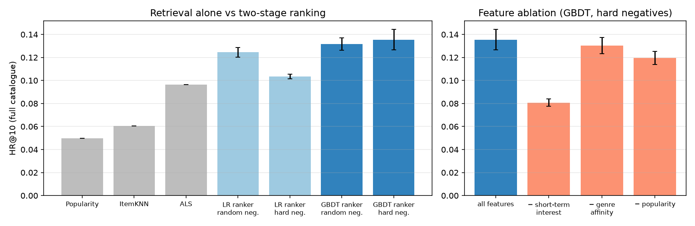
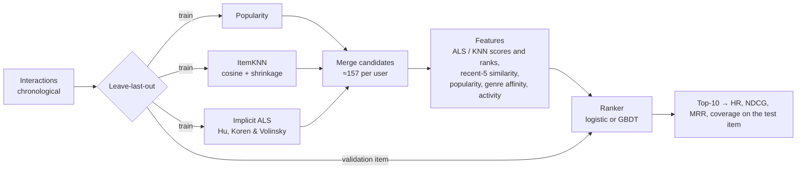

# Recommendation Ranking Lab

[](https://github.com/asher0913/recsys-ranking-lab/actions/workflows/ci.yml)

[](LICENSE)

A two-stage recommender evaluated end to end on **MovieLens-100K**. Stage one merges candidates
from three retrievers (popularity, item-item KNN and implicit-feedback ALS); stage two re-ranks
them with a learned model over retrieval, short-term-interest, popularity and genre features.
Evaluation is chronological leave-last-out over the **full catalogue**, with no sampled negatives
at test time, and with a validation item used for every tuning decision.



## Quick start

```bash
git clone https://github.com/asher0913/recsys-ranking-lab && cd recsys-ranking-lab
python3 -m venv .venv && . .venv/bin/activate && pip install -e '.[dev]'
recsys-lab run --dataset synthetic --no-tune --seeds 1            # offline, seconds: the whole pipeline end to end
recsys-lab run --data-dir data --out runs/movielens_100k.json      # the real benchmark below, several minutes on a laptop
```

The first run needs no download and is what CI runs on every push. The second one downloads
MovieLens-100K (5 MB) from GroupLens, checks its SHA-256, tunes the retrievers on the validation
item, trains 5 seeds of each ranker and regenerates every number in the tables below.

## Results

943 users, 1,682 movies, 100,000 interactions. Each user's last movie is the test target and the
one before it the validation target; every movie the user has already seen is excluded from their
ranking. Ranker rows are the mean ± std over 5 seeds (negative sampling and model randomness).

| Model | HR@10 | NDCG@10 | MRR | Catalogue coverage@10 |
|---|---:|---:|---:|---:|
| Popularity | 0.050 | 0.025 | 0.018 | 5% |
| ItemKNN (cosine, shrinkage) | 0.060 | 0.028 | 0.019 | 12% |
| Implicit ALS | 0.097 | 0.052 | 0.038 | 47% |
| Two-stage, logistic ranker, random negatives | 0.125 ± 0.004 | 0.064 ± 0.001 | 0.046 | 48% |
| Two-stage, logistic ranker, hard negatives | 0.104 ± 0.002 | 0.052 ± 0.002 | 0.037 | 72% |
| Two-stage, GBDT ranker, random negatives | 0.132 ± 0.005 | 0.065 ± 0.004 | 0.045 | 55% |
| **Two-stage, GBDT ranker, hard negatives** | **0.136 ± 0.009** | **0.068 ± 0.003** | **0.048** | 57% |

**Candidate recall** (test item present in the candidate set): ALS top-100 48.9%, ItemKNN top-100
28.0%, popularity top-20 8.2%, merged set **54.3%** at 157 candidates per user on average. That
is the ceiling any ranker can reach.

### What the numbers say

- **The second stage is worth 40%.** The best ranker lifts HR@10 from 0.097 (ALS alone) to 0.136
  and NDCG@10 from 0.052 to 0.068, re-ranking the same candidates ALS mostly supplied.
- **Sequence dominates.** Removing a single feature, similarity to the user's five most recent
  movies, drops HR@10 by 40% (0.136 → 0.081). Next-item prediction on a chronological split is
  a sequential problem, and a long-term profile alone misses it. Popularity is worth 12%; genre
  affinity is within noise.
- **Hard negatives are not a free win.** For the GBDT ranker they are indistinguishable from
  random negatives (0.136 ± 0.009 vs 0.132 ± 0.005). For the logistic ranker they *hurt*
  (0.125 → 0.104): hard negatives are items with high retrieval scores, so a linear model learns
  to down-weight exactly the features that find the positive. The tree model can carve out
  "high score but not the one" regions instead.
- **Retrieval sets the diversity.** Coverage rises from 5% of the catalogue (popularity) to 47%
  (ALS); rankers trained on hard negatives push it higher still.

## Pipeline



**No leakage by construction.** Retriever hyper-parameters are selected by validation NDCG@10
(8 ALS and 9 ItemKNN configurations; the winners were 32 factors, λ = 1, α = 10 and 200
neighbours, shrinkage 10). The ranker is trained on validation targets using features from
retrievers fitted on training data only. At test time the retrievers are refitted on training
plus validation interactions and the frozen ranker scores their candidates.

**Implementation notes.**
- ALS solves each user and item exactly with the `YᵀY + Yᵤᵀ(Cᵤ − I)Yᵤ` identity, so each half
  step costs time proportional to observed interactions rather than the full matrix.
- ItemKNN prunes each item to its top neighbours after shrinkage, which damps similarities
  supported by only a handful of co-occurrences.
- Top-k selection uses `argpartition` with a deterministic tie-break on item id, so results are
  reproducible bit for bit.

## Evidence and CI coverage

| Result | Kind of evidence | File | Rerun in CI? |
|---|---|---|---|
| Model table, candidate recall, feature ablation | **real data**: MovieLens-100K, chronological leave-last-out, full-catalogue ranking | `results/movielens_100k.json`, `docs/results.png` | **Not on every push**: the full run takes several minutes and downloads GroupLens data that may not be redistributed. The `MovieLens reproduction` workflow runs it weekly and on demand, and `scripts/check_claims.py` checks every model within 0.01 HR@10 and 0.006 NDCG@10 of the committed run, plus each claim on this page. |
| The pipeline runs end to end and beats random ranking | synthetic users with drifting tastes | `tests/`, CI smoke run | Yes |
| Split, top-k, masking, ALS, ItemKNN and metric correctness | unit tests on hand-computed cases | `tests/test_recsys.py` (12 tests) | Yes, on Python 3.10 and 3.12 |

Reproducibility details:

- **Data version:** `ml-100k.zip` from GroupLens, SHA-256 `50d2a982…6a3229`, checked by
  `recsys-lab download` before anything is unpacked.
- **Seeds:** retrievers use seed 0; each ranker row averages seeds 0–4, which set negative
  sampling (`training_pairs`) and the GBDT's `random_state`.
- **Configuration:** the selected ALS and ItemKNN settings and every tuning row are stored in
  `results/movielens_100k.json` under `config` and `tuning`.

## Design trade-offs

| Decision | Chosen | Alternative | Why |
|---|---|---|---|
| Evaluation | chronological leave-last-out, full catalogue, seen items masked | random split with 100 sampled negatives | Sampled negatives inflate metrics and can reorder models; a random split leaks the future. |
| Tuning | validation item only, retrievers refitted on train + validation for test | tune on test | Every number in the table is a single test-set evaluation. |
| Two stages | merge ALS, ItemKNN and popularity candidates, then re-rank | one model over the full catalogue | The ranker can use features (recency similarity, popularity) that no single retriever combines; candidate recall of 54.3% is its ceiling. |
| Ranker | pointwise GBDT | LambdaMART or a sequence model | Pointwise is simple and was enough to show where the lift comes from; listwise and sequential models are the next step (Limitations). |

## Failure cases

- **Hard negatives hurt the linear ranker.** Logistic regression with hard negatives drops from
  0.125 to 0.104 HR@10: it learns to down-weight the retrieval scores that find the positive.
- **46% of test items are never in the candidate set.** No ranker can recover them; better
  retrieval, such as a sequence model, is the only fix.
- **Genre affinity adds nothing measurable.** Removing it changes HR@10 within seed noise.

## Code map

| File | What to look at |
|---|---|
| `src/recsys/data.py` | `download_movielens` (checksum), `load_movielens`, `leave_last_out`, the synthetic generator |
| `src/recsys/retrieval.py` | `Popularity`, `ItemKNN` (shrunk cosine, top-neighbour pruning), `ImplicitALS` (exact per-user solves), `mask_seen`, `top_k` |
| `src/recsys/pipeline.py` | `tune_retrievers`, `merge_candidates`, `features`, `training_pairs` (random vs hard negatives), `make_ranker`, `run_experiment` |
| `src/recsys/metrics.py` | HR@K, NDCG@K, MRR and candidate recall |

## Usage

```bash
pip install -e '.[dev]'

recsys-lab download --dest data                       # MovieLens-100K, checksum verified
recsys-lab run --data-dir data --out results/movielens_100k.json   # several minutes
recsys-lab run --dataset synthetic --no-tune --seeds 1              # offline smoke run
python scripts/make_figures.py                        # needs matplotlib
```

## Tests

`pytest -q` runs 12 tests on a synthetic dataset with drifting user tastes (no download needed):
the leave-last-out split, train-plus-validation assembly, deterministic top-k, masking of seen
items, ItemKNN symmetry and the shrunk cosine value, ALS separating observed from unobserved
pairs, the metrics on a hand-computed ranking, candidate sets without duplicates or seen items,
training-pair construction for both negative strategies, an end-to-end run clearly beating
random ranking, and the CLI.

## Limitations

- MovieLens-100K is small and old; the absolute numbers are for comparing methods under one
  protocol, not for predicting production click-through.
- One test item per user makes metrics noisy: at 943 users, a 0.005 difference in HR@10 is about
  five users.
- No sequence model (GRU4Rec, SASRec) is included. Given how much the short-term feature matters,
  one is the obvious next retriever.
- The ranker is pointwise. A pairwise or listwise objective (LambdaMART) would optimise NDCG
  directly.

## Data

MovieLens-100K is downloaded from GroupLens at run time and is not redistributed here. Terms:
research use with citation. F. Maxwell Harper and Joseph A. Konstan. 2015. *The MovieLens
Datasets: History and Context.* ACM Transactions on Interactive Intelligent Systems 5(4), 19.

## License

MIT (code only)
