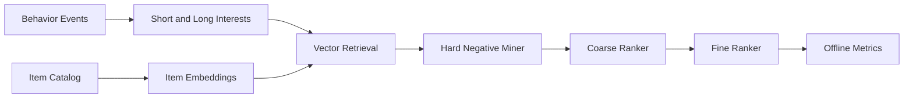

# Recommendation Ranking Lab

A transparent multi-stage recommendation stack with short/long-term interests, hard-negative mining, retrieval-to-ranking alignment, and reproducible offline metrics.

This repository implements an original, laptop-scale reference system for a
production problem that repeatedly appears in strong AI/ML/software-engineering
portfolios. It focuses on architecture, failure handling, evaluation, and
reproducibility instead of claiming access to proprietary infrastructure.

## What is implemented

- Deterministic hash embeddings for users, items, and text features
- Recency- and action-weighted short/long-term user interests
- Vector retrieval, hard-negative mining, coarse ranking, and fine ranking
- Objective alignment using top-ranked positives as retrieval labels
- Recall@K, NDCG@K, MRR, and candidate-overlap evaluation

## Architecture



## Quick start

```bash
python -m venv .venv
source .venv/bin/activate
python -m pip install -e .
python -m unittest discover -s tests -v
PYTHONPATH=src python src/recsys_ranking_lab/core.py
```

The demo prints a self-contained JSON report from seeded synthetic fixtures;
wall-clock latency values are machine-dependent. It is safe to run offline and
does not require credentials, paid APIs, GPUs, or employer data.

## Evaluation contract

The demo creates a seeded catalog and implicit-feedback sessions, holds out each user's final positive interaction, and evaluates ranking quality against that hidden item. No online A/B claims are made.

## Repository layout

- `src/recsys_ranking_lab/core.py` - executable reference implementation
- `tests/test_core.py` - deterministic regression and failure-path tests
- `benchmark-report.json` - checked-in output from the deterministic demo
- `.github/workflows/ci.yml` - clean-install CI on Python 3.12

## Scope and provenance

The problem definition was inspired by recurring engineering patterns observed
while reviewing a large resume corpus. All naming, source code, fixtures, and
documentation in this repository are original. Reported demo numbers are local
synthetic measurements, not production claims. The system is intentionally
compact so reviewers can inspect every design decision.

## License

MIT
